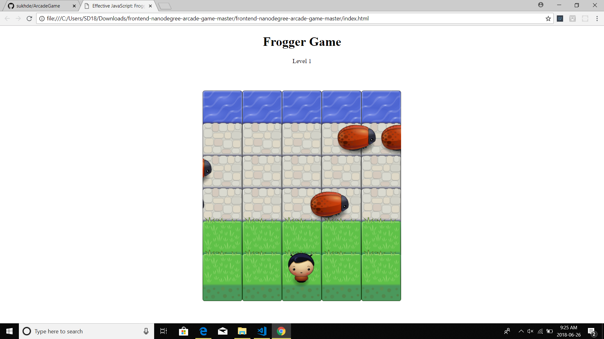
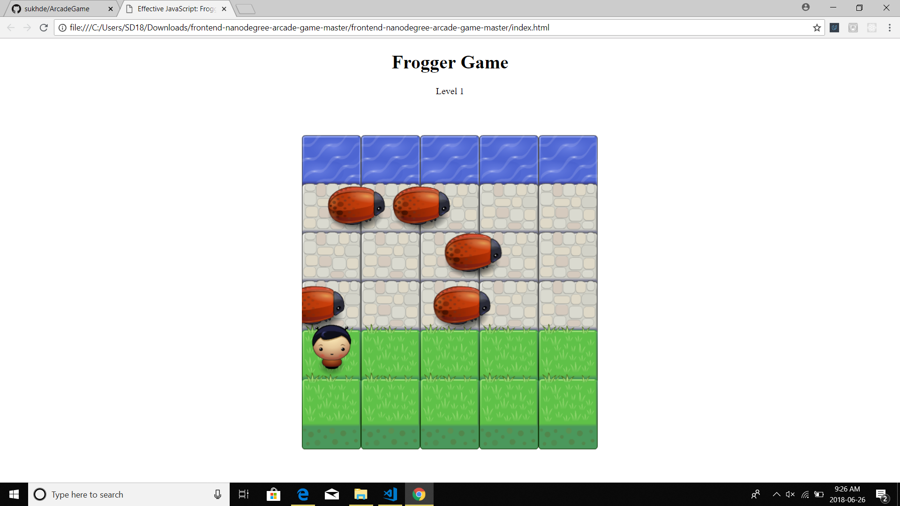
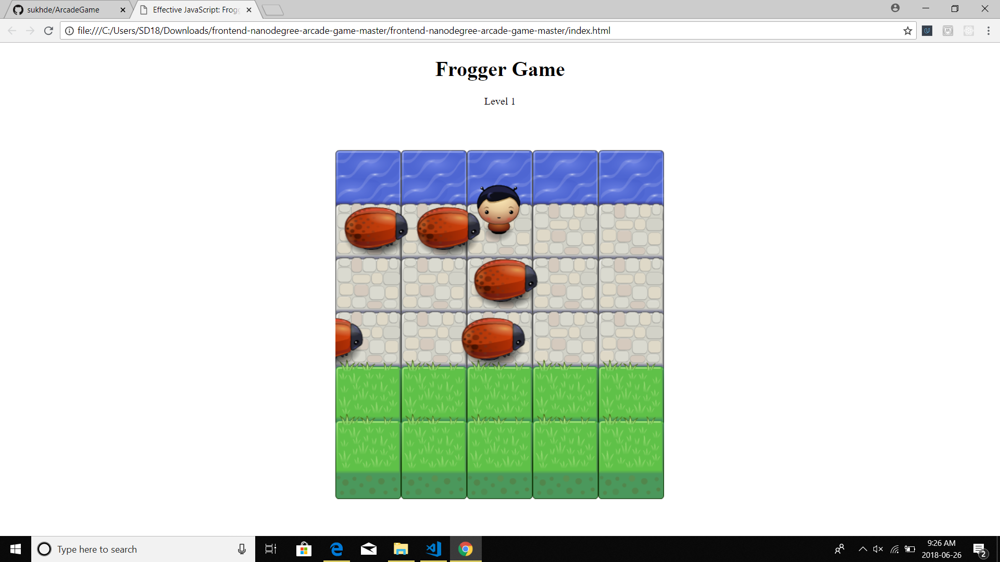
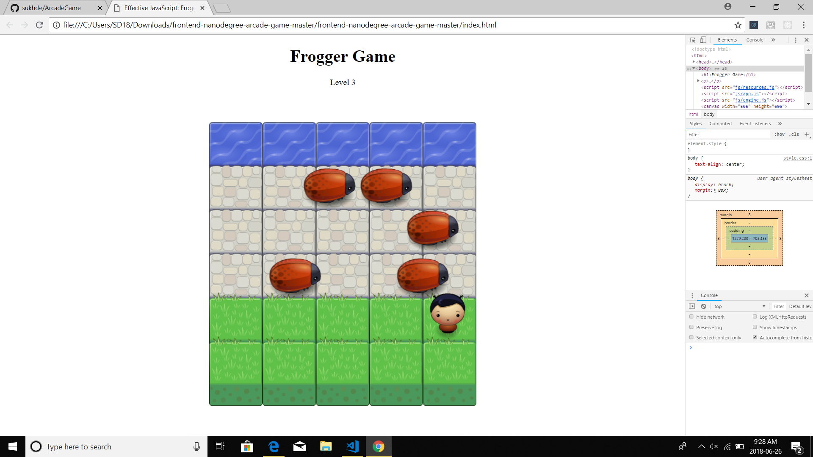
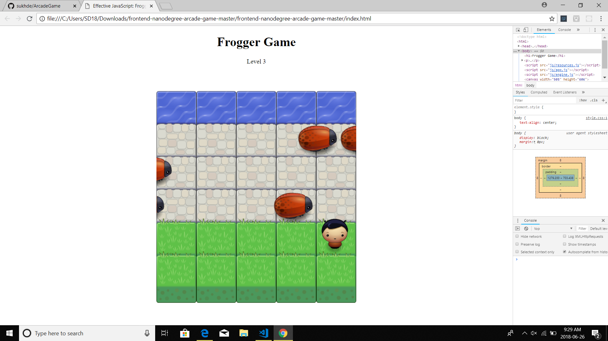

## My arcade game 

## Description
The game have a Player and Enemies (Bugs). The goal of the player is to reach the water, without colliding into any one of the enemies. The player can move left, right, up and down. Once a the player collides with an enemy, the game is reset and the player moves back to the start square. Once the player reaches the water then you win the game.

## Details 

## Author
Sukhdeep sidhu
